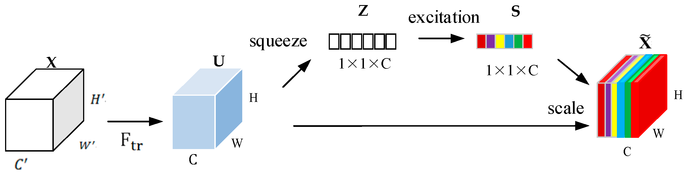
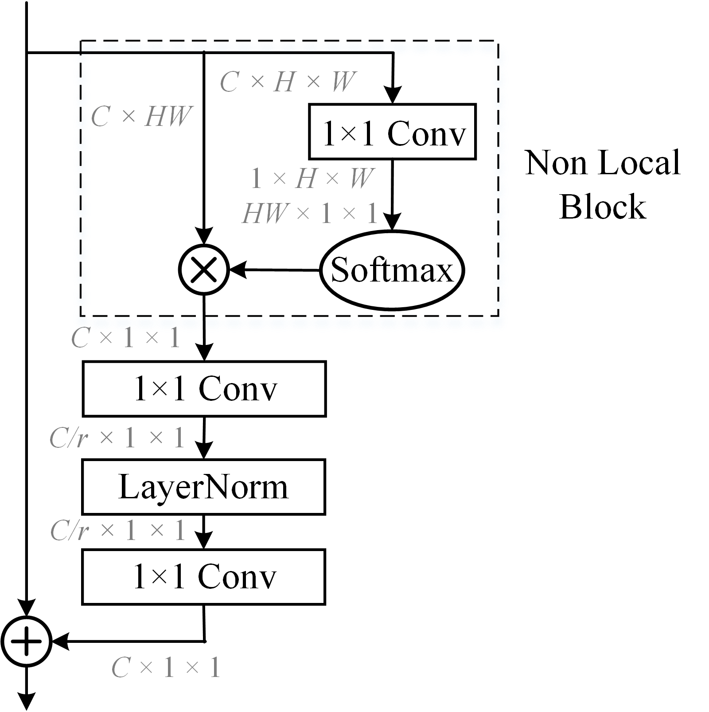
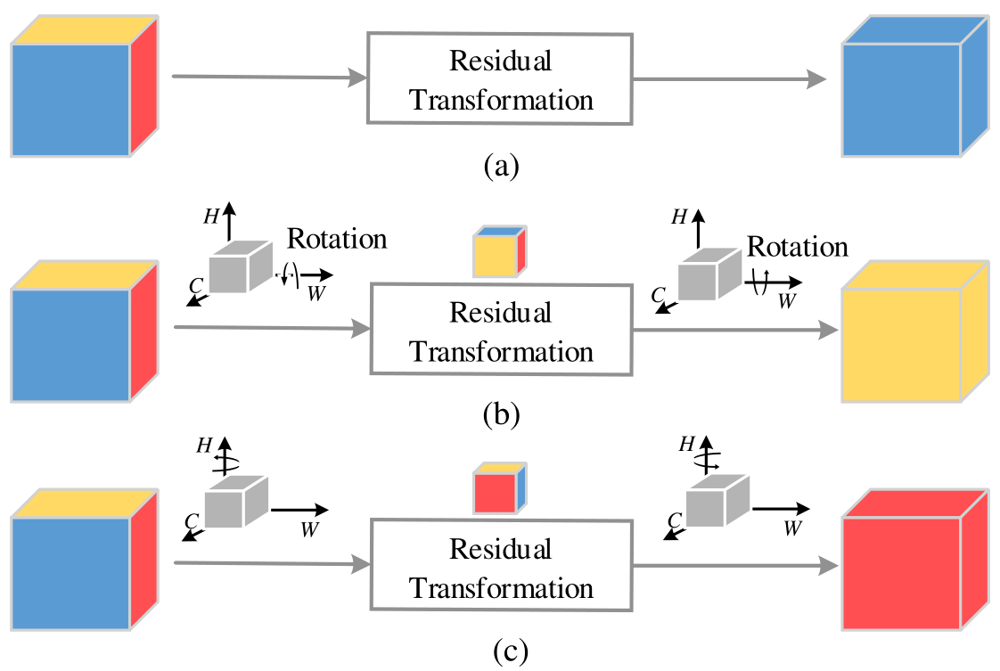
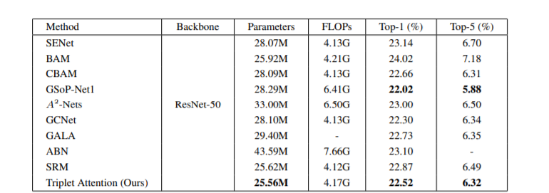
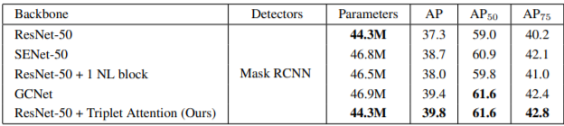
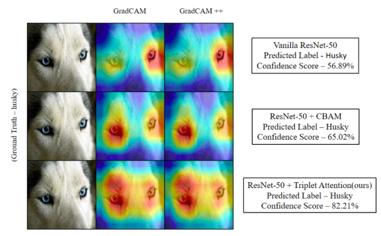

+++
title = "Attention in Computer Vision"
outputs = ["Reveal"]
+++

{}

# Attention in Computer Vision

---

## Squeeze-Excite Networks

First to efficiently model cross-channel relationship in feature maps by learning channel-specific weights

---

## CBAM

Fused channel and spatial attenion into a single module for visual recognition.

---

## Global-Context Networks

Combines channel attention with non-local block to learn long-range dependancies

---

## Shortcomings

- Treat Dimensions Independently
- Computationally Expensive
- Information Bottlenecks

{}

---

{}

# Cross-Dimensional Interaction

---

</img>

{}

---

{}

# Triplet Attention

---

<figure>

<figcaption class="text">
(a) Squeeze Excitation (b) CBAM; (c) Global Context Module; (d) Triplet Attention (ours)
</figcaption>
</figure>

---

Triplet Attention Structural Design

{}

---

{}

# Results

---

## Image Classification

---

## Object Detection

---

## GradCAM

---



---



---



---

{}

---

Code and Pretrained Models:

https://landskapeai.github.io/publication/triplet/

---

<h3 align="left">References</h3>

<ol align="left" style="font-size: 22px">
    <li> Yue Cao,  Jiarui  Xu,  Stephen  Lin,  Fangyun  Wei,  and  HanHu. Gcnet: Non-local  networks  meet  squeeze-excitation networks  and  beyond. In Proceedings  of  the  IEEE  International Conference on Computer Vision Workshops, pages 0–0, 2019 </li>
    <li> Jie Hu, Li Shen, and Gang Sun. Squeeze-and-excitation networks. 2018 IEEE/CVF Conference on Computer Vision and Pattern Recognition, Jun 2018 </li>
    <li> Sanghyun  Woo,  Jongchan  Park,  Joon-Young  Lee,  and  InSo Kweon.   Cbam:  Convolutional block attention module.In The European Conference on Computer Vision (ECCV),September 2018. </li>
    <li> Yunpeng  Chen,  Yannis  Kalantidis,  Jianshu  Li,  Shuicheng Yan,  and  Jiashi  Feng. Aˆ2-nets:   Double  attention  networks. In Advances in Neural Information Processing Systems, pages 352–361, 2018. </li>
    <li> Zilin Gao, Jiangtao Xie, Qilong Wang, and Peihua Li. Global second-order pooling convolutional networks. In Proceedings of the IEEE Conference on Computer Vision and Pattern Recognition, pages 3024–3033, 2019 </li>
</ol>
